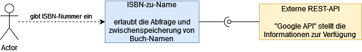
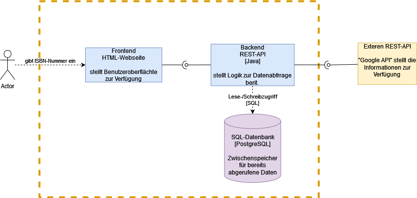

# sqs23
SQS Vorlesung Sommersemester 2023

Bei diesem Projekt handelt es sich um ein Vorlesungsprojekt der Veranstaltung Software Qualitätssicherung der Technischen Hochschule Rosenheim.

# ISO-to-Name

Bei ISO-to-Name handelt es sich um Programm Mithilfe es möglich ist, den Buchnamen zu einer ISBN herauszufinden.

Mithilfe dieses Architekturüberblicks sollen die maßgeblichen Entwurfsentscheidungen nachvollziehbar werden.
Es werden die Strukturen der Lösungen sowie das Zusammenspiel zentraler Elemente aufgezeigt.
Die Gliederung der Inhalte erfolgt nach der ARC42-Vorlage.

# 1. Einführung und Ziele

Dieser Abschnitt soll in die Aufgabenstellung einführen.
Zusätzlich werden die Ziele skizziert, welche ISO-to-Name verfolgt.

## 1.1 Aufgabenstellung

### Was ist ISO-to-Name

- Ein voll funktionsfähiges Programm
- Aufgabe ist das Herausfinden des Buchnamens zu der dazugehörigen ISBN
- Hierfür wird eine externe API (Google-API) befragt.
- Aus Performancegründen wird das Ergebnis in einer eigenen Datenbank zwischengespeichert.

### Wesentliche Features:

    - Handhabung von 10- und 13-stelligen ISBN-Nummern
    - Überprüfen, ob es sich um eine gültige ISBN-Nummer handelt.
    - Cachen der Antwort

## 1.2 Qualitätsziele
| Quality Category          | Quality             | Description                                                                                                                                                                   | Szenario |
|:--------------------------|:--------------------|:------------------------------------------------------------------------------------------------------------------------------------------------------------------------------|:--------:|
| Usability                 | Leicht zu bedienen  | Der Endbenutzer soll mithilfe einer integrierten Webseite die Möglichkeit haben, seine ISBN nummer einzugeben, ohne dafür direkt mit der API zu kommunizieren.                                                                                                                         |          |
|                           | Leicht zu verstehen | Die Anwendung sollte individuell verständlich sein, ohne dass sie vorher in einem langwierigen Prozess erlernt werden muss.                                                   |          |
| Performance               | Genauigkeit         | Der zurückgegebene Titel sollte auch zu der angegebenen ISBN gehören                                                                                                          |          |
|                           | Robustheit          | Das System muss unter allen angegebenen Umgebungs- und Betriebsbedingungen zuverlässig funktionieren.                                                                         |          |
| Maintainability & Support | Wartbarkeit         | Durch das Setzen von verschiedenen Env-Variablen soll es möglich sein, leicht ein Test-Set-up aufzusetzen, oder einzelne Schnittstellen auszutauschen. |          |
|                           | Überprüfung         | Durch die Überprüfung der empfangenen Anfrage soll sichergestellt werden, dass nur korrekte Daten empfangen werden.                                                           |  10.2.1  |
| Security                  | Integrität          | Für die Kommunikation der API-Schnittstelle von Google wird ein Token benötigt. Dieses wird mithilfe einer ENV-Variable eingelesen, damit dieses individuell und nicht statisch ist.                                                                              |          |

## 1.3 Stakeholder

| Role/Name | Contact | Expectations                                                                            |
|-----------|:--------|:----------------------------------------------------------------------------------------|
| Endnutzer | /       | Einfache Handhabung der REST-Schnittstelle zur Ermittlung des Titels anhand einer ISBN. |

# 2. Randbedingungen
Für den Lösungsentwurf mussten zu Beginn verschiedene Randbedingungen beachtet werden.
Mithilfe dieses Abschnitts sollen diese erläutert werden und wenn nötig auch die dazugehörige Motivation.

## 2.1 Technische Randbedingungen

| Randbedingung           | Erläuterung, Hintergrund                                                                                                                                                                                                                           |
|-------------------------|----------------------------------------------------------------------------------------------------------------------------------------------------------------------------------------------------------------------------------------------------|
| Virtualisierung         | Mithilfe von Docker soll es möglich sein, die Software auf verschiedenen Subsystemen auszuführen. Docker ist hierbei für die Verwendung kostenlos, wodurch auch Endverbraucher ohne Kosten die Software verwenden können.                          |
| Implementierung in Java | In der Hochschule wurde hauptsächlich Java gelehrt und auch bei Projekten verwendet. Daher ist hier eine Grunderfahrung vorhanden.                                                                                                                 |
| Postgresql Datenbank    | Da die Daten in einer Datenbank zwischengespeichert werden, wurde hierfür Postgres verwendet. Hierbei handelt es sich um ein freies, objektrelationales Datenbankmanagementsystem. Auch hier sind durch vorherige Projekte Erfahrungen vorhanden. |

## 2.2 Organisatorische Randbedingungen

| Randbedingung                          | Erläuterung, Hintergrund                                                                                                                                                                                      |
|----------------------------------------|---------------------------------------------------------------------------------------------------------------------------------------------------------------------------------------------------------------|
| Team                                   | Lukas Kolb, unterstützt durch die Vorlesung.                                                                                                                                                                  |
| Zeitplan                               | Beginn der Entwicklung war April 2023, erster lauffähiger Prototyp war Mai 2023. Fertistellung mit sämtlichen Tests war im Juni 2023.                                                                           |
| Vorgehensmodell                        | Entwicklung risikogetrieben, iterativ und inkrementell. Zur Dokumentation der Architektur kommt arc42 zum Einsatz. Eine Architekturdokumentation, gegliedert nach dieser Vorlage, ist ein zentrales Projektergebnis. |
| Entwicklungswerkzeuge                  | Erstellung der Java-Quelltexte in IntelliJ. Die Software muss allerdings auch alleine mit Gradle, ohne IDE baubar sein, damit diese später in einem Dockercontainer laufen kann.                              |
| Konfigurations- und Versionsverwaltung | Github                                                                                                                                                                                                        |
| Testwerkzeuge und -prozesse            | JUnit im Annotationsstil sowohl für inhaltliche Richtigkeit als auch für Integrationstests und die Einhaltung von Effizienzvorgaben. K6 für Lasttest. Endtests werden mithilfe von Cypress durchgeführt. Docker wird per pre-commit mithilfe von Hadolint überprüft. Abhängigkeiten werden mithilfe des Github dependabot überprüft. Zusätzlich wird das Repo von Gitguard überprüft. Zusätzlich wird mithilfe von Archtests die Architektur getestet. Die statische Codeanalyse wird per [Sonarcloud](https://sonarcloud.io/project/overview?id=DasKoebi_sqs23) durchgeführt. |
| Veröffentlichung als Open Source       | Die Quelltexte der Lösung oder zumindest Teile werden als Open Source, verfügbar gemacht. Lizenz: GNU General Public License Version 3.0,(GPLv3). Gehostet bei GitHub: https://github.com/DasKoebi/sqs23       |

## 2.3 Konventionen

| Randbedingung                | Erläuterung, Hintergrund                                                                    |
|------------------------------|---------------------------------------------------------------------------------------------|
| Architekturdokumentation     | Terminologie und Gliederung nach dem deutschen arc42-Template in der Version 6.0            |
| Kodierrichtlinien für Java   | Java Coding Conventions von IntelliJ geprüft. Zusätzlich werden Archtets verwendet                                              |
| Kodierrichtlinien für Docker | Docker Empfehlungen mithilfe von Hadolint per pre-commit überprüft. |
| Statische Codeanalyse | Sonarcloud übernimmt die statische Codeanalyse. |

# 3. Kontextabgrenzung

Mithilfe dieses Abschnittes wird das Umfeld beschrieben. Hier wird beschrieben, für welchen Nutzer das System ist und mit welchen Fremdsystemen es interagiert.

## 3.1 Fachlicher Kontext

Mithilfe folgender Grafik soll die logische Architektur des Systems veranschaulicht werden.
Hierbei ist die Kommunikation mit dem Nutzer und die Anbindung zu externen Systemen erkennbar.

## 3.2 Technischer- oder Verteilungskontext

Zuerst werden die zentralen Bausteine des Softwaresystems dargestellt.
Auch soll ersichtlich sein, wie diese interagieren.

# 4. Lösungsstrategie
Hier werden die wichtigsten Ziele und Lösungsansätze gegenübergestellt.

## 4.1 Einstieg in die Lösungsstrategie

| Analysierbarkeit  | - Architekturüberblick gegliedert nach arc42 - explizites, objektorientiertes Domänenmodell |
|-------------------|---------------------------------------------------------------------------------------------|
| Änderbarkeit      | - verbreitete Programmiersprache Java, - Hohe Testabdeckung als Sicherheitsnetz             |
| Interoperabilität | - Verwendung des verbreiteten Kommunikationsprotokolls HTTP,  Einsatz des portablen Java    |
| Portabilität      | - Einsatz durch Docker                                                                  |

## 4.2 Der Aufbau von ISBN-to-Name

ISBN-to-Name ist als Java-Programm mit Springboot realisiert.
Grob lässt es sich in folgende Teile aufteilen:

- eine Implementierung der HTTP-GET-Schnittstelle
- einen Kommunikationsservice mit der Datenbank
- einen Kommunikationsservice mit der Google API
- einen Service zur Überprüfung der ISBN

Mithilfe dieser Zerlegung ist es möglich, dinge wie die Kommunikation zu Google API auszutauschen.
Ale Teile sind durch Schnittstellen abstrahiert. Die Zerlegung ermöglicht es weiterhin, die Software leicht automatisch zu testen.

**Spring Boot** ist ein weitverbreitetes Framework, welches es ermöglicht, Java-REST-Endpunkte zu verwirklichen

**PostgreSQL** ist eine moderne und weitverbreitete SQL-Datenbank, welche kostenlos zur verfügung steht.

**GoogleAPI** Die Google-API ist mithilfe eines privaten Schlüssels kostenfrei zu benutzen und bietet viele Daten an. Daher ist diese auch das mittel der Wahl für dieses Projekt.

## 4.3 Anbindung

ISBN-to-Name besitzt ein integriertes Frontend. Welches es den Benutzer ermöglicht, Anfragen nicht nur über eine HTTP-Get anfrage zu stellen, sondern diese bequem im Browser durchzuführen.

# 5. Bausteinsicht

Die einzelnen Bausteine sind bereits in [Kapitel 3](#Kontextabgrenzung) ersichtlich.
Daher werden diese hier nicht erneut aufgelistet.

# 6. Laufzeitsicht

Nachdem ein Nutzer eine Eingabe vorgenommen hat, wird diese durch das Frontend an das Backend weitergeleitet.
Hierbei handelt es sich um eine GET-Request, welche den eingegebenen Inhalt in der URL als Parameter enthält.

Im Backend wird anschließend überprüft, ob die erhaltenen ISBN 10- oder 13-Stellen aufweist.
Daraufhin wird die Prüfziffer der jeweiligen ISBN-Nummer berechnet.
Sobald dies erfolgreich überprüft wurde, wird in der Datenbank geschaut, ob die ISBN-Nummer bereits vorhanden ist.

Sollte dies nicht der Fall sein, so wird die ISBN-Nummer an die Google-API weitergereicht und das Ergebnis in der Datenbank gespeichert und dem Nutzer ausgegeben.

Sollte die ISBN-Nummer in der Datenbank enthalten sein, so wird direkt der dazugehörige Name ausgegeben.

Mithilfe folgendem Sequenzdiagramm soll dieser Prozess veranschaulicht werden.

# 7. Verteilungsschicht

Diese Schicht beschreibt den Betrieb von ISBN-to-Name.
Dadurch das dieses Programm als Dockercontainer zur Verfügung steht, ist dies recht anspruchslos.

## 7.1 Infrastruktur

Software-Voraussetzungen auf dem PC:
 - Docker

Zusätzliche Voraussetzungen:
 - Google-API key

Damit die Anwendung gestartet werden kann, ist eine Docker-Compose Datei beigelegt.
Diese dient als Vorlage, wobei hier noch die Variable `API_KEY` angepasst werden muss.
Zusätzlich sollte für das Datenbankpasswort ein anderer Wert vergeben werden.

# 8. Querschnittliche Konzepte

## Sicherheit

Die Sicherheit im System wird durch verschiedene Security-Tests geprüft.
Die API ist so gestaltet das der Benutzer nur lese Zugriff auf das System hat.

## Frontend

Durch einfache Gestaltung des Frontends soll der Benutzer nicht überfordert sein.

## Verfügbarkeit

Sollte es vorkommen, dass die externe Datenbank nicht verfügbar ist, so können mithilfe der integrierten Datenbank zumindest Namen zu bereits abgerufenen ISBN-Nummern überprüft werden.

## Intern

Die empfangene ISBN wird im Backend überprüft.

Durch die Größe der Anwendung scheint ein explizites Session-Handling nicht notwendig zu sein.

# 9. Entscheidungen

Hier sollen gewisse Entscheidungen nachvollzogen werden können.

## 9.1 Übermittlung der ISBN
Die ISBN wird anhand der aufgerufenen URL abgeleitet.
Der Aufbau ist exemplarisch: `https://www.example.com/v1/books/${ISBN}`

## 9.2 Projektsprache
Das Projekt wird in Java geschrieben, da hier das vorhandene Know-How verwendet werden kann.
Außerdem wurden schon vor diesem Projekt REST-Schnittstellen in dieser Sprache intern verwirklicht.

## 9.3 Datenbank
Bei der Datenbank handelt es sich um eine Postgres Datenbank, da auch hier das Know-How vorhanden ist und sich diese leicht auf jedem System realisieren lässt.

## 9.4 Docker

Docker wurde unter anderem deswegen verwendet, da es kostenlos verwendet werden kann.
Durch diese Virtualisierung kann auf allen gängigen Systemen wie Windows, Linux und Mac das Programm verwendet werden.

Außerdem ist es mithilfe der CI-Pipline möglich, das Programm automatisch neu zu bauen und als Container online zur Verfügung zu stellen.
Somit kann sehr schnell und einfach immer die neuste Version verwendet werden.

# 10. Qualitätsanforderungen

Dieser Abschnitt beinhaltet konkrete Qualitätsszenarien.

## 10.1 Quality Scenarios
| ID | Description |
| --- | --- |
| Benutzereingaben | ISBN-Nummern sollen auf ihre Korrektheit überprüft werden. Dazu soll die Prüfziffer berechnet werden |
| Datenschutz | Es sollen keine personenbezogenen Daten abgespeichert werden. |
| Anpassbarkeit | Mithilfe einzelnen ENV-Variablen soll es möglich sein, die Anwendung leicht zu testen und auf spezifische Gegebenheiten einzurichten |
| Kompatibilität | Die Anwendung soll mithilfe von Docker auf den gängigsten Systemen wie Mac OS, Linux und Windows funktionsfähig sein. |

## Env-Variablen für die Anpassbarkeit
| Name       | Beschreibung                                                                                     | Beispiel                                              | Standardwert                                          |
|------------|--------------------------------------------------------------------------------------------------|-------------------------------------------------------|-------------------------------------------------------|
| `API_KEY`  | Der API-Key für die Google-Datenbank. Dieser wird benötigt, um Abfragen bei Google zu ermöglichen | `A791023AKC843123`                                    | Keinen                                                |
| `BASE_URI` | Die Base URI der Google-API, an diese werden die ISBN-Nummern gesendet.                          | `https://www.googleapis.com/books/v1/volumes?q=isbn:` | `https://www.googleapis.com/books/v1/volumes?q=isbn:` |
| `SPRING_DATASOURCE_URL` | Hierbei handelt es sich um die URL, welche die Anwendung benötigt, um sich mit der Datenbank zu verbinden. | `jdbc:postgresql://db:5432/postgres` | `jdbc:postgresql://host.docker.internal:5432/postgres` |
| `SPRING_DATASOURCE_USERNAME` | Hierbei handelt es sich um den Benutzernamen des Datenbankbenutzers | `postgres` | `postgres` |
| `SPRING_DATASOURCE_PASSWORD` | Hierbei handelt es sich um das Passwort des Datenbankbenutzers | `changeMe!` | Keinen |

# 11 Risiken

## 11.1 Flasche Interpretation der ISBN-Nummer

Sollte die ISBN-Nummer nicht korrekt aus der URL des GET-Request interpretiert werden, so schlägt die ganze Anwendung fehl.

## Eventualfallplanung

Es wäre möglich, von einer GET-Request auf eine POST-Request umzubauen, bei dieser wird die ISBN in einem JSON-Boddy mitgeschickt.
Dieser kann wiederum validiert werden, was allerdings einen großen Mehraufwand bedeuten würde.

## Risikominderung

Durch frühe und vermehrte Test kann hier Sicherheit geboten werden.

# 11.2 Tests

## Unittests
 - JUNIT 5 Tests
 - Mit diesen Test soll die Korrektheit einzelner Funktionen geprüft werden.

## ArchTest
Mithilfe der ArchUnit wird die Architektur überprüft
## Integrationstest / End-to-End Tests
Mithilfe von Cypress wird ein End-to-End Test durchgeführt, welche auch gleichzeitig als Integrationstest dient.

## Statische Codeanalyse
Mithilfe der CI-Pipeline wird das Projekt an Sonarcloud zur Analyse gesendet.
Hier wird die statische Analyse des Codes durchgeführt. Mithilfe der Badges soll das Ergebnis von Sonarcloud leicht ersichtlich sein.

## Pre-Commit
Da die Anwendung als Dockercontainer zur verfügung steht, welcher ebenfalls in der CI-Pipeline gebaut wird, wird die dazugehörige Dockerfile von Hadolint überprüft.
Hierbei wird durch einen Pre-Commit die Datei auf Fehler überprüft.
Zusätzlich werden auch kleinere Hooks, wie `end-of-file-fixer` durchgeführt.

## Abhängigkeiten
Damit das Projekt nicht durch Abhängigkeiten offene Sicherheitslücken aufweist, ist für dieses Projekt der Github integrierten Service DependaBot aktiviert und GitGuard eingerichtet.

## Lasttest

Mithilfe von k6 werden Lasttest für die Anwendung getestet.
Diese baut in einem Zeitraum von einer Minute 50 Nutzer auf und testet anschließend zwei Minuten mit diesen die Anwendung. Anschließend wird weiterhin eine Minute getestet und dabei die Anzahl der Nutzer wieder auf 0 verringert.
Hierbei wird einmal ein Lasttest mithilfe einer funktionierenden ISBN und einer falschen ISBN durchgeführt.
